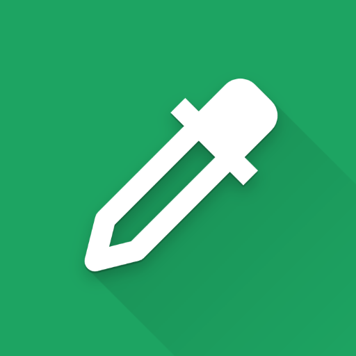

# Screen Color Picker

A powerful Android app that lets you pick colors from anywhere on your screen in real-time. Perfect for designers, developers, and anyone who needs to extract color values quickly without taking screenshots.

## ✨ Features

- **Real-time Color Picking**: Capture colors from any pixel on your screen
- **Magnified Preview**: See a zoomed-in view with grid lines for precise color selection
- **Draggable Interface**: Move the target circle to any position on screen
- **Quick Settings Tile**: Access from the notification panel for instant color picking
- **Copy to Clipboard**: Click to copy color hex codes or coordinates
- **Customizable Settings**: Adjust magnifier size, capture speed, and more
- **Overlay Support**: Works over other apps without interrupting your workflow

## 🚀 How to Use

1. **Launch the app** from your home screen
2. **Grant permissions** when prompted:
   - Overlay permission (to display over other apps)
   - Notification permission (for color picker service)
   - Screen capture permission (to capture colors from screen)
3. **Drag the target** to the area you want to sample
4. **View the magnified preview** with the selected color information
5. **Click on hex color or coordinates** to copy to clipboard
6. **Use the floating action button** to start/stop the color picker

## ⚙️ Settings

The app offers several customization options:

- **Magnifier Size**: Small (150dp), Medium (200dp), Large (250dp)
- **Capture Speed**: Fast (40 FPS), Normal (20 FPS), Slow (10 FPS)
- **Capture Range**: Small, Medium, Large (affects target size)
- **Grid Lines**: Toggle-able grid overlay on magnifier

## 🔧 Requirements

- Android 7.0 (Nougat) or higher
- Required permissions:
  - `SYSTEM_ALERT_WINDOW` - For overlay windows
  - `POST_NOTIFICATIONS` - For service notifications
  - `FOREGROUND_SERVICE` - For background service
  - `FOREGROUND_SERVICE_MEDIA_PROJECTION` - For screen capture

## 💡 Perfect For

- **UI/UX Designers**: Extract colors from mockups and existing designs
- **Developers**: Get color codes from apps, websites, and design systems
- **Digital Artists**: Sample colors from images and videos
- **Power Users**: Quick color reference for any project

## 🛠️ Technical Details

- **Built with**: Kotlin, AndroidX, Material Design
- **Screen Capture**: Uses Android's MediaProjection API
- **Architecture**: Clean separation between UI and service layers
- **Performance**: Optimized bitmap handling with configurable capture intervals
- **Memory Efficient**: Automatic bitmap recycling to prevent leaks

## 📄 License

This project is licensed under the MIT License - see the [LICENSE](LICENSE) file for details.

## 🤝 Contributing

Contributions are welcome! Please feel free to submit a Pull Request.

## 📧 Support

If you encounter any issues or have questions, please open an issue on GitHub.

---

Made with ❤️ by [codehasan](https://github.com/codehasan)
