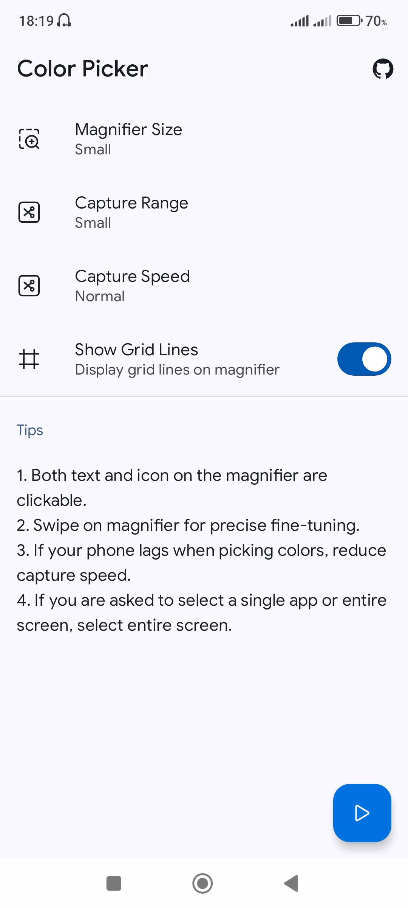
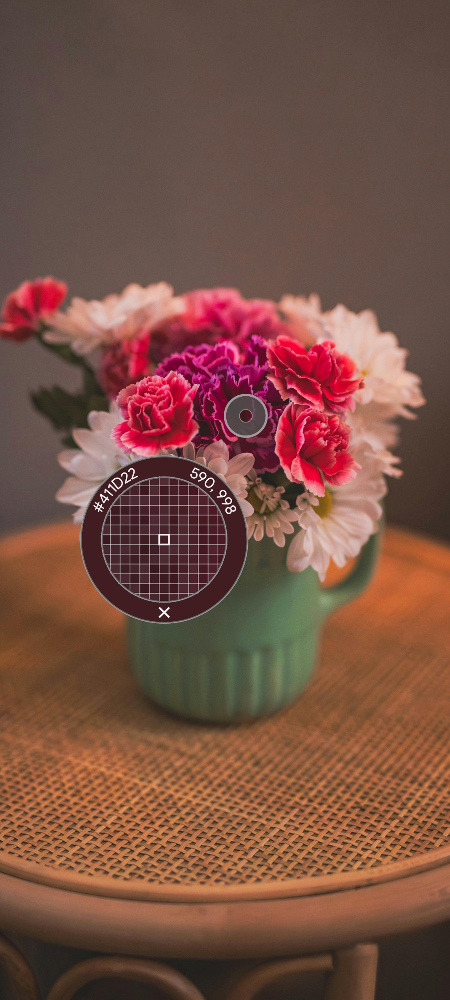
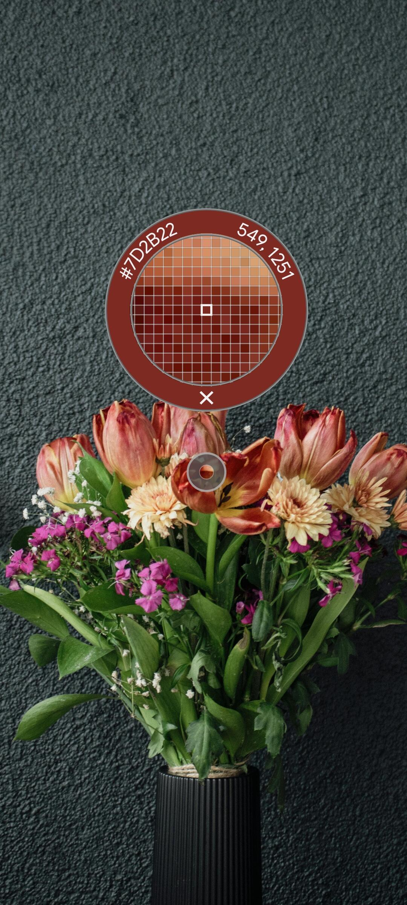
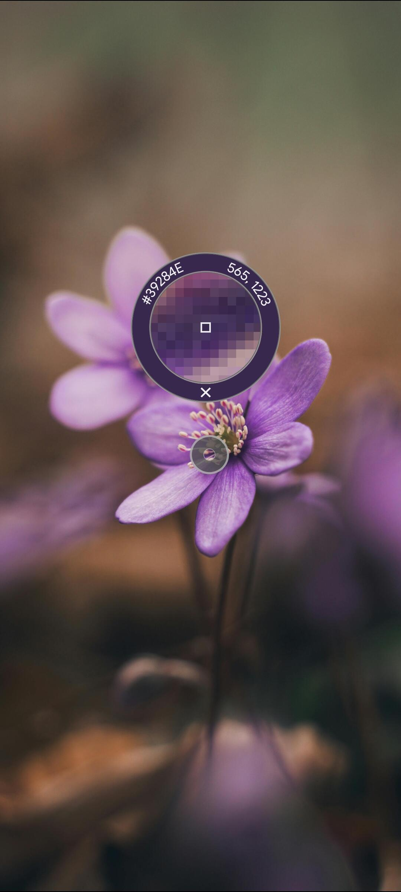

<div align="center">


# Screen Color Picker

A powerful Android app that lets you pick colors from anywhere on your screen in real-time. Perfect
for designers, developers, and anyone who needs to extract color values quickly without taking
screenshots.

[](LICENSE)
[](https://www.android.com/)
[](https://github.com/codehasan/ScreenColorPicker/releases/latest)

[](https://play.google.com/store/apps/details?id=io.github.codehasan.colorpicker)
[](https://github.com/codehasan/ScreenColorPicker/releases/latest)

</div>

## ✨ Features

- **Real-time Color Picking**: Capture colors from any pixel on your screen
- **Magnified Preview**: See a zoomed-in view with grid lines for precise color selection
- **Draggable Interface**: Move the target circle to any position on screen
- **Quick Settings Tile**: Access from the notification panel for instant color picking
- **Copy to Clipboard**: Click to copy color hex codes or coordinates
- **Customizable Settings**: Adjust magnifier size, capture speed, and more
- **Overlay Support**: Works over other apps without interrupting your workflow

## 📸 Screenshots

You can watch a video demo as well - [YouTube](https://youtube.com/shorts/EXXz2l9ck9Y)

<div align="center">
  
  
  
  
</div>

## 🚀 How to Use

1. **Launch the app** from your home screen
2. **Grant permissions** when prompted:
    - Overlay permission (to display over other apps)
    - Notification permission (for color picker service)
    - Screen capture permission (to capture colors from screen)
3. **Drag the target** to the area you want to sample
4. **View the magnified preview** with the selected color information
5. **Click on hex color or coordinates** to copy to clipboard
6. **Use the floating action button** to start/stop the color picker

## ⚙️ Settings

The app offers several customization options:

- **Magnifier Size**: Small (150dp), Medium (200dp), Large (250dp)
- **Capture Speed**: Fast (40 FPS), Normal (20 FPS), Slow (10 FPS)
- **Capture Range**: Small, Medium, Large (affects target size)
- **Grid Lines**: Toggle-able grid overlay on magnifier

## 🔧 Requirements

- Android 7.0 (Nougat) or higher
- Required permissions:
    - `SYSTEM_ALERT_WINDOW` - For overlay windows
    - `POST_NOTIFICATIONS` - For service notifications
    - `FOREGROUND_SERVICE` - For background service
    - `FOREGROUND_SERVICE_MEDIA_PROJECTION` - For screen capture

## 💡 Perfect For

- **UI/UX Designers**: Extract colors from mockups and existing designs
- **Developers**: Get color codes from apps, websites, and design systems
- **Digital Artists**: Sample colors from images and videos
- **Power Users**: Quick color reference for any project

## 🛠️ Technical Details

- **Built with**: Kotlin, AndroidX, Material Design
- **Screen Capture**: Uses Android's MediaProjection API
- **Architecture**: Clean separation between UI and service layers
- **Performance**: Optimized bitmap handling with configurable capture intervals
- **Memory Efficient**: Automatic bitmap recycling to prevent leaks

## 📄 License

This project is licensed under the [MIT License](LICENSE).

```
Copyright (c) 2026 Ratul Hasan

THE SOFTWARE IS PROVIDED "AS IS", WITHOUT WARRANTY OF ANY KIND, EXPRESS OR
IMPLIED, INCLUDING BUT NOT LIMITED TO THE WARRANTIES OF MERCHANTABILITY,
FITNESS FOR A PARTICULAR PURPOSE AND NONINFRINGEMENT. IN NO EVENT SHALL THE
AUTHORS OR COPYRIGHT HOLDERS BE LIABLE FOR ANY CLAIM, DAMAGES OR OTHER
LIABILITY, WHETHER IN AN ACTION OF CONTRACT, TORT OR OTHERWISE, ARISING FROM,
OUT OF OR IN CONNECTION WITH THE SOFTWARE OR THE USE OR OTHER DEALINGS IN THE
SOFTWARE.
```

## 🤝 Contributing

Contributions are welcome! Feel free to:

1. Fork the repository
2. Create a feature branch (`git checkout -b feature/AmazingFeature`)
3. Commit your changes (`git commit -m 'Add some AmazingFeature'`)
4. Push to the branch (`git push origin feature/AmazingFeature`)
5. Open a Pull Request

## 📧 Support

- 🐛 Found a bug? [Report an issue](https://github.com/codehasan/ScreenColorPicker/issues)
- 💡 Have a
  suggestion? [Open a discussion](https://github.com/codehasan/ScreenColorPicker/discussions)
- 📧 Email: [codehasan](mailto:codehasan@hotmail.com)

---

<div align="center">

Made with ❤️ by [codehasan](https://github.com/codehasan)

</div>
